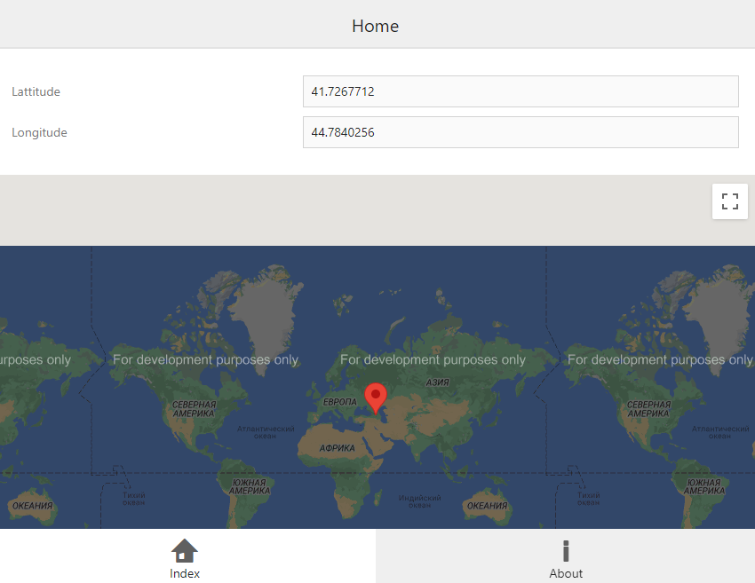

# Map for DevExtreme - How to add the current location marker

This example describes how to use the dxMap widget with <a href="http://dev.w3.org/geo/api/spec-source.html"><u>HTML5 Geolocation</u></a>. 

## Files to Review

- **jQuery**
    - [index.html](jQuery/index.html)
    - [script.js](jQuery/script.js)

## Documentation

- [Map - API Reference](https://js.devexpress.com/Documentation/ApiReference/UI_Components/dxMap/)
- [How to take advantage of map provider API features that were not implemented in the dxMap widget?](http://www.devexpress.com/Support/Center/Question/Details/KA18782)
- [Map for DevExtreme - How to add draggable markers](http://www.devexpress.com/Support/Center/Example/Details/E4639)
